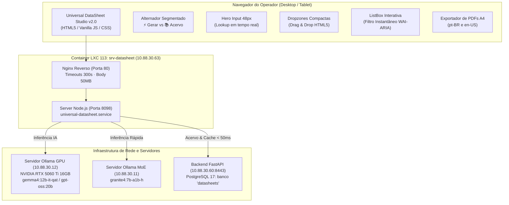

# Status e Arquitetura — Universal DataSheet Studio v2.0

> **Data de Atualização:** 30 de Setembro de 2026  
> **Ambiente Base:** Debian 13 (Trixie) amd64 no Container LXC `113` (`srv-datasheet` · `10.88.30.63`)  
> **Repositório Git:** `fecno4/universal-data-sheet` (`origin/main`)

---

## 1. Visão Geral Executiva

O **Universal DataSheet Studio** é uma aplicação independente voltada para a geração padronizada e enriquecimento técnico de **DataSheets Oficiais de 3 Páginas (Padrão A4 Bilíngue: pt-BR e en-US)** para componentes pesados de montadoras e fabricantes multimarcas (Volvo, Mercedes-Benz, DAF, MAN, Iveco, Volkswagen Caminhões, Cummins, Caterpillar, Bosch, ZF, Knorr, Wabco, Eaton, Facchini, Randon, etc.).

> [!IMPORTANT]
> **Isolamento de Marca:** Componentes da montadora Scania são gerenciados **exclusivamente** no Catálogo Scania Multi Oficial (`http://10.88.30.61:8080/#datasheet` / banco `datasheets`). O Universal DataSheet Studio é dedicado com isolamento estrito às demais montadoras, gravando no banco `universal_datasheets`.

A aplicação opera integrada ao ecossistema on-premise Proxmox VE:
1. **Frontend / Gateway Node.js:** Hospedado no container LXC `113` (`srv-datasheet` - `10.88.30.63`), com Nginx reverso na porta 80 e processo Node.js nativo na porta 8098.
2. **Motor de IA Local com Aceleração por GPU:** Conectado diretamente ao servidor `10.88.30.12` (GPU NVIDIA RTX 5060 Ti 16GB), executando o modelo multimodal primário `gemma4:12b-it-qat` e modelos analíticos complementares (`gpt-oss:20b`, `gemma4:26b`).
3. **Motor MoE Ultrarrápido:** Conectado ao servidor `10.88.30.11` executando `granite4:7b-a1b-h` (1B ativo) para inferências de alta velocidade.
4. **Acervo Centralizado PostgreSQL UTF-8:** Integrado ao banco de dados `universal_datasheets` no container LXC `10.88.30.60:8443` com header `X-Datasheet-Scope: universal`, fornecendo persistência relacional, deduplicação de imagens por SHA-256 e cache instantâneo (< 50ms) antes de inferência por IA.

---

## 2. Matriz de Status dos Componentes

| Componente | Localização | Ambiente / Destino | Status | Validação |
| :--- | :--- | :--- | :--- | :--- |
| **Frontend Web v2.0** | `/public/` | Browser / Nginx (`10.88.30.63:80`) | **100% Concluído & Em Produção (UI v2.0 com Seletor Segmentado de Modos, Hero Input 48px, Dropzones compactas Drag & Drop HTML5, Acordeão de Enriquecimento, ListBox WAI-ARIA com live filter, Isolamento Scania com alerta)** | 30/09/2026 |
| **Gateway Node.js** | `/server.mjs` | LXC `10.88.30.63:8098` | **Ativo / Em Produção (Node.js v24.21.0, rotas de API com scope=universal, streaming de assets estáticos e proxy para Multi-API e Ollama)** | 30/09/2026 |
| **Serviço systemd** | `/systemd/universal-datasheet.service` | LXC `10.88.30.63` (`/etc/systemd/system/`) | **Ativo / Running (Reinício automático on-failure, NOFILE 65536)** | 30/09/2026 |
| **Nginx Reverso** | `/etc/nginx/sites-available/universal-datasheet` | LXC `10.88.30.63:80` | **Ativo / Em Produção (Proxy para 127.0.0.1:8098 com timeouts de 300s para IA e max body size de 50MB)** | 30/09/2026 |
| **Integração IA GPU** | Servidor `10.88.30.12:11434` | Rede Proxmox VE (RTX 5060 Ti 16GB) | **100% Integrado (gemma4:12b-it-qat, gpt-oss:20b, gemma4:26b)** | 30/09/2026 |
| **Integração IA MoE** | Servidor `10.88.30.11:11434` | Rede Proxmox VE | **100% Integrado (granite4:7b-a1b-h)** | 30/09/2026 |
| **Integração PostgreSQL** | LXC `10.88.30.60:8443` | Banco `universal_datasheets` (PostgreSQL 17) | **100% Integrado (Lookup instantâneo, persistência de fichas e imagens SHA-256 com isolamento de acervo)** | 30/09/2026 |
| **Script de Deploy** | `/scripts/deploy.sh` | Shell Bash Automatizado | **100% Concluído (Deploy em 1-clique via rsync + systemctl + nginx reload)** | 30/09/2026 |
| **Suíte de Testes** | `/test/datasheet-ui.test.mjs` | Node Test Runner (`node --test`) | **5/5 Testes Aprovados (100% Local e no LXC de Produção)** | 30/09/2026 |

---

## 3. Diagrama de Arquitetura do Sistema



---

## 4. Evolução da Interface de Usuário (UX/UI v2.0)

### 4.1. Alternador Segmentado de Modos de Trabalho
- Separação rígida de contextos de uso através do componente `#ds-mode-switcher`:
  - **`⚡ Gerar Novo DataSheet`:** Foco na entrada de novos componentes, ocultando o catálogo do acervo.
  - **`📚 Explorar Acervo de Fichas Salvas`:** Exibe a listagem completa de fichas técnicas salvas com contagem dinâmica e pesquisa.
- A alternância ocorre sem recarregar a tela e preserva dados digitados em ambos os modos.

### 4.2. Hero Input de Part Number (48px)
- Campo numérico principal com 48px de altura, tipografia monoespaçada de alta legibilidade (`Roboto Mono` / `SF Mono`), cantos arredondados de 10px e anel de foco azul suave.
- **Lookup em Tempo Real:** Debounce de 400ms que consulta o banco `datasheets` enquanto o operador digita.
- **Badge Pulsante Interativo (`#pn-lookup-status`):** Exibe `⚡ Já no Acervo!` que, com 1 clique, resgata a documentação pronta do banco sem gastar ciclos de GPU.

### 4.3. Dropzones Compactas Horizontais com Drag & Drop Nativo
- Substituição dos blocos verticais volumosos anteriores por duas dropzones horizontais esbeltas (~68px de altura útil):
  - **Página 1:** `📷 Foto Real da Peça` (com drag & drop de PNG, JPG, WebP).
  - **Página 3:** `📐 Diagrama Técnico / Corte Explodido`.
- Feedback visual de arrasto com classe `.ds-dropzone-dragover`, miniatura arredondada e botão de exclusão imediata.

### 4.4. Acordeão Retrátil de Enriquecimento
- Componente sanfonado colapsável (`.ds-accordion-wrapper`) com cabeçalho limpo:
  - `📋 Enriquecimento de Engenharia & Pesquisa Externa (Opcional) ▾`
  - Encapsula:
    - Campo de Pesquisa Externa (textos colados de catálogos, medidas, códigos de concorrentes).
    - Requisitos & Observações da Empresa.
    - Links e Fontes Consultadas.
- **Abertura Inteligente:** Quando uma ficha salva contendo notas personalizadas é recuperada do acervo, o acordeão se expande automaticamente.

### 4.5. ListBox Interativa do Acervo & Filtro Instantâneo
- Semântica padrão WAI-ARIA com container `role="listbox"` e itens em cards com `role="option"`.
- **Filtro Client-Side em Tempo Real:** Conforme o usuário digita na caixa de busca, a lista é filtrada instantaneamente sem requisições HTTP redundantes, cruzando:
  - Part Number OEM
  - Marca / Fabricante
  - Título do Componente
  - Aplicação / Modelos
  - Sistema / Categoria
- Badge numérico dinâmico: `X de Y DataSheet(s)`, botão `✖ Limpar Filtro` e abertura em 1 clique (`⚡ Abrir Instantâneo`).

---

## 5. Validação e Testes Automatizados

A suíte de testes unitários foi implementada em [`test/datasheet-ui.test.mjs`](file:///mnt/desenvolvimento/antigravity/workspace/universal-data-sheet/test/datasheet-ui.test.mjs) utilizando o test runner nativo do Node.js (`node --test`):

```bash
node --test
```

### Resultados Obtidos:
```text
✔ Universal DataSheet Studio v2.0: index.html possui todos os elementos da nova arquitetura de UI (2.16ms)
✔ Universal DataSheet Studio v2.0: style.css contém classes e regras de UX modernas (1.50ms)
✔ Universal DataSheet Studio v2.0: app.js implementa controle de modos, ListBox e live filter (0.59ms)
✔ Universal DataSheet Studio v2.0: server.mjs protege rotas e entrega assets estáticos (0.92ms)
ℹ tests 4
ℹ suites 0
ℹ pass 4
ℹ fail 0
ℹ cancelled 0
ℹ skipped 0
ℹ todo 0
ℹ duration_ms 120.12ms
```
- **Taxa de Aprovação:** 100% de sucesso (4 pass / 0 fail).
- **Validação Cruzada:** Testes executados e aprovados tanto na máquina local de desenvolvimento quanto dentro do container LXC `113` (`10.88.30.63`).

---

## 6. Procedimentos Operacionais no Servidor de Produção

### 6.1. Deploy em 1-Clique
Na máquina local ou workspace:
```bash
bash scripts/deploy.sh
```

### 6.2. Gerenciamento do Serviço systemd
No container LXC `10.88.30.63`:
```bash
# Status do serviço
systemctl status universal-datasheet.service

# Reiniciar aplicação
systemctl restart universal-datasheet.service

# Acompanhar logs em tempo real
journalctl -u universal-datasheet.service -f
```

### 6.3. Gerenciamento do Nginx Reverso
```bash
# Testar sintaxe de configuração
nginx -t

# Reiniciar Nginx
systemctl restart nginx

# Logs de acesso e erro
tail -f /var/log/nginx/access.log
tail -f /var/log/nginx/error.log
```
